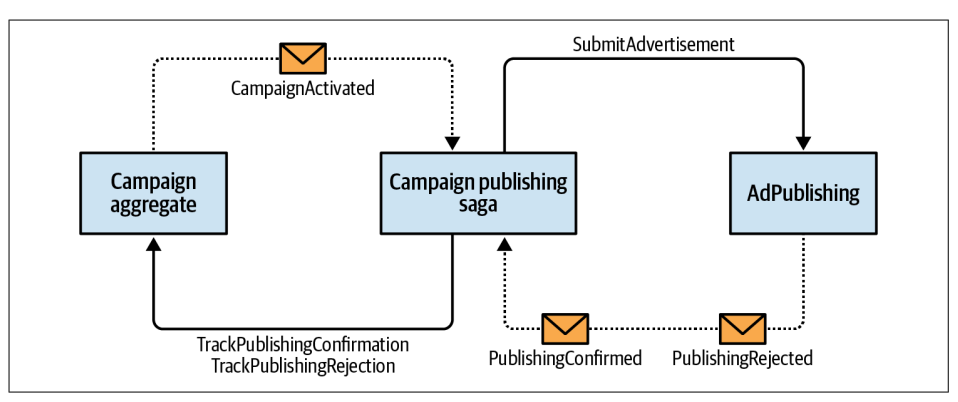
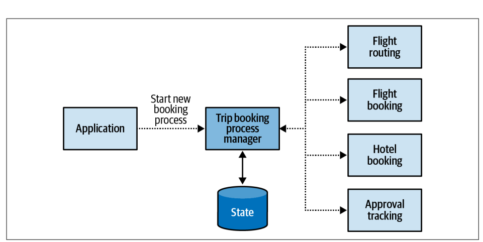

# Learning-Domain-Driven-Design
Summary of book

### CHAPTER 1
## Analyzing Business Domains

Cos'e' il business domain:
E' il servizion che una compagnia offre ai propri e potenziali clienti. Ogni azienda ne puo' avere piu' di uno

Subdomains:
I domini vengono suddivisi in sotto domini, ognunco con un obbiettivo specifico e diverso.

Tipi di subdomains:
- core subdomain
- generic subdomain
- supporting subdomain

#### Core subdomain
E' il valore aggiunto che ha l'azienda nei confronti dei competitors (ad esempio inventare prodotti o servizi). Dovrebbe avere un alta complessita' per evitare di essere replicato facilmente. La fonte del vantaggio competitivo non e'
per forza di natura tecnologica. (Ad esempio un'azienda che produce gioielli il vantaggio e' dato dall'artigiano)

#### Generic subdomain
Sono le attivita' piu' generiche che tutte le aziende possono fare nella stessa maniera (ad esempio un meccanismo di autenticazione). Non e' vincolante il fatto che sia un attivita' semplice, il vero vincolo e' che non da alcun vantaggio competitivo se fatto in maniera diversa/migliore dei competitors.

#### Supporting subdomain
Supporta il core business della compagnia, ha un vantaggio farlo in maniera custom ma non deve avere alta complessita'. Non e' il principale business dell'azienda, ad asempio una campagna pubblicitaria di un prodotto. Supporta il core business ma non puo' esserlo)

I subdomain si distinguono per altri due aspetti: La volatility e la solution strategy.

#### Volatility
Il core subdomain puo' variare spesso, scelte di business, nuovi tentativi per migliorare il prodotto, cambio di target etc.
Il supporting subdomain non dovrebbe cambiare molto spesso in quanto non porta reale vantaggio competitivo coi competitors, a fronte di un grande sforzo non si hanno grandi vantaggi.
Il generic subdomain puo' cambiare in ottica di miglioramento ad esempio applicando delle patch di sicurezza aggiornando la versione di una libreria.

#### Solution strategy
Per il core subdomain e' sicuramente ideale sviluppare la soluzione internamente. In modo tale da poter fare evolvere il prodotto nella maniera piu' veloce possibile. L'azienda deve avere come obbiettivo di mantenere questa parte con la qualita' piu' alta possibile.
Il generic subdomain si puo' tranquillamente esternalizzare in quanto solitamente sono soluzioni generiche e configurazioni custom (codice open source)
Il supporting subdomain e' ideale svilupparlo internamente anche attraverso l'utilizzo di qualche framework. Data la complessita' bassa di questo dominio e' adatto ad essere assegnato a sviluppatori meno esperti i quali possono fare pratica.

Domain experts

E' importante indetificare queste persone le quali saranno le persone che daranno un impatto piu' importante sul prodotto.
Sono le persone che conoscono in maniera approfondita il settore. Non sono gli sviluppatori, nemmeno gli analisti. Sono coloro che hanno una conoscenza approfondita del problema ed esperienza diretta, coloro che potrebbero anche utilizzare il software.


### CHAPTER 2
## Discovering Domain Knowledge

Questo capitolo e' concentrato nella spiegazione dell'importanza dell' "ubiquitous language".

### Business Problems
L'obbiettivo aziendare e' fornire una soluzione per i problemi dei clienti.
La parola problema non deve essere interpretata come un problema matematico o qualcosa che puo' essere risolto con la matematica.

Durante il capitolo spiega l'importanza di evitare tanti livelli di comunicazione perche' ad ogni livello si perdono informazioni (telefono senza fili)
Definire un liguaggio univoco e' utile per evitare fraintendimenti.

### What Is a Model?

Spiega che un modello non e' la coppia reale di una determinata cosa ma un costrutto umano che ci aiuta a dare un senso ai sistemi del mondo reale.
Per essere piu' chiaro fa un esempio di una mappa. La stessa mappa puo' rappresentare dettagli specifici, per esempio la mappa di una citta' che mostra la metropolitana piuttosto che le strade della citta'. Oppure la divisione in fusi orari piuttosto che le zone di calore.

### CHAPTER 3
## Managing Domain Complexity


In questo capitolo viene introdotto il concetto di "bounded context". Lo fa facendo un esempio, la stessa parola "lead" ha significato diverso per il team di marketing e il team di vendita. Vengono proposte varie soluzioni non funzionali o non ottimali. Viene proposto a questo punto di utilizzare i Bounded context. Li accomuna alle mappe del paragrafo precedente. E proprio come in quelle mappe servono per far vedere alcuni dettagli specifici anche nei vari contesti servono informazioni diverse.
Quindi nel contesto del reparto di vendite il "lead" avra' determinate caratteristiche mentre nel contesto di marketing il lead ne avra' altre. Inoltre ogni bunded context ha un ubiquitous language specifico. Quindi il lead nei vari contesti assume significati leggermente diversi.

### CHAPTER 4
## Integrating Bounded Contexts

I confini tra i vari bounded context devono essere chiari. Pero' tra vari contesti ci puo'/deve essere comunicazione, ma se ognuno ha una linguaggio diverso la comunicazione puo' risultare difficile. Per questo vengono utilizzate delle forme di comunicazione chiamate "contratto".
Ce ne sono di tre tipi:
- cooperation
- customer–supplier
- separate ways

#### Cooperation
In quest ocaso i team dovranno avere un ottima comunicazione, il successo di un team dipende dal successo dell'altro.
Ci sono principalmente 2 pattern di integrazione: Partnership, Shared Kernel

##### Partnership
E' basato su una comunicazione molto frequente, infatti non e' indicato per i team distribuiti.
Ogni team comunica con l'altro riguardo i cambiamenti delle API o dei modelli (per esempio) e l'altro team si occupa di integrare le modifiche.

##### Shared Kernel
Ci puo' essere il caso in cui alcuni modelli possano essere utili in multipli contesti, ad esempio il modello per l'autorizzazione.
Questo modello e' importante che abbia solo gli elementi necessari per i vari contesti. Questo perche', per definizione, viola il principio di isolamento dei contesti.
Per capire quando usare il shared kernel bisogna analizzare il costo di dupplicazione rispetto al costo di coordinazione. Se il costo di dupplicazione e' basso e' giusto che ogni contesto abbia i suoi modelli. Se invece e' altro potrebbe essere utile utilizzare questo approccio. Quando il costo di dupplicazione e' alto? Sopratutto quando il modello cambia spesso. Comunicare con tutti i vari moduli le modifiche potrebbe essere impegnativo e generare errori.
Violando il principio descritto sopra il suo utilizzo deve essere giustificato.

#### Customer–supplier
Diversamente dal pattern di cooperation il customer supplier ha due team dove il successo e' indipendente l'uno dall'altro.
Il contratto di integrazione puo' essere definito da entrambe le parti (upstream team e downstream team)
Viene applicato attravero l'utilizzo di 3 patterns:
- conformist
- anticorruption layer
- open-host service

##### Conformist
Il fornitore non ha reale interesse per supportare le necessita' del cliente. Utilizza un approccio "Take it or leave it". Il cliente puo' decidere se aderire o meno a questo tipo di contratto. Solitamente sono contratti Standard industriali (ad esempio API. REST). Quindi il fornitore ha totale controllo sul codice rilasciato.

##### Anticorruption layer (ACL)
Come nel pattern conformist l'autorita' e' sblianciata sul upstream service. In questo caso il servizio downstream non si vuole adattare completamente e crea un layer intermedio che fa da interprete.
Quando viene applicato:
- Quando il servizio destinatario contiente il core subdomain. In quanto dovrebbe essere totalmente indipendente dal fornitore.
- Quando il servizio upstream e' ineficiente
- Quando il servizio upstream cambia spesso, in questo modo si cambia solo il meccanismo di traduzione.

##### Open-Host Service
E' l'inverso del ACL, il fornitore ci tiene ai clienti quindi si adatta alle loro esigenze. Crea un servizio che slega il codice interno da quello esposto (chiamato pub‐
lished language). Quando deve cambiare qualcosa implementa diverse versioni del servizio e il cliente decidera' di cambiare versione una volta pronto.


#### Separate Ways
Questa e' l'ultima opzione di collaborazione. Non collaborare affatto.

##### Communication Issues
Quando ci sono dei problemi di comunicazione gravi conviene dupplicare le funzionalita' nei vari bounded contexts.

##### Generic Subdomains
Il sottodominio duplicato da la possibilita' di prendere strade separate.  Nei generic subdomain che sono facili da integrare puo' essere conveniente duplicare le integrazioni invece che avere un servizio condiviso. Un esempio puo' essere il servizio di Logging.

##### Model Differences
Quando c'e' troppa differenza tra i modelli dei vari contesti conviene andare in vie separate.


### CHAPTER 5

#### Implementing Simple Business Logic
In questo capitolo vengono spiegate 2 tecniche per gestire la logica di business "semplice".
- Transaction script
- Acrive records

##### Transaction script
Procedura molto semplice che permette di accedere direttamente al database e salvare i dati. C'e' da fare particolare attenzione nel caso in cui vengono eseguite due operazioni ma una delle due fallisce lasciando lo stato del sistema non consistente. Questa e' la principale difficolta' da affrontare.

Consiglia quindi di utilizzare un sistema a transazioni come questo
```
public class LogVisit
{
 ...
 public void Execute(Guid userId, DataTime visitedOn)
 {
 try
 {
 _db.StartTransaction();
 _db.Execute(@"UPDATE Users SET last_visit=@p1
 WHERE user_id=@p2",
 visitedOn, userId);
 _db.Execute(@"INSERT INTO VisitsLog(user_id, visit_date)
 VALUES(@p1, @p2)",
 userId, visitedOn);
 _db.Commit();
 } catch {
Transaction Script | 65
 _db.Rollback();
 throw;
 }
 }
}
```
Tutto e' semplice se agiamo in un sistema monolite con utilizzo di database che gestisce le transazioni. Diventa piu' complesso se dobbiamo fare la stessa cosa se le operazioni sono collegate attraverso un bus di messaggi o se utilizziamo un db che non gestisce le transazioni.
Viene fatto un cenno alle operazioni idempotenti: ovvero quelle operazioni che possono essere eseguite piu' volte senza modificare piu' volte lo stato del sistema.

##### Active Record
`Un oggetto che racchiude una riga in una tabella o vista di database, incapsula l'accesso al database e aggiunge la logica di dominio su tali dati.`
In questa tecnica non si ha accesso direttamente al database ma l'accesso viene fatto attraverso un tool, come tutti i tool il libro spiega che bisogna valutare bene pro e contro.
Oltre alla struttura dati questi oggetti implementano anche dei metodi chiamati CRUD. Di conseguenza gli oggetti sono fortemente accomppiati al database. Il tool utilizzato e' chiamato ORM (object-relational mapping).
Grazie a questo framework si e' piu' slegati al servizio di storage, pero' comunque crea un forte accoppiamento tra i dati sul database e i modelli di dominio.

Per questi motivi l'utilizzo di queste 2 tecniche e' fortemente sconsigliato nel core subdomain.


### CHAPTER 6
Tackling Complex Business Logic

Questo capitolo spiega come gestire domini piu' complessi.

Domain Model
E' un pattern che ha l'intenzione di gestire logiche piu' complesse. (non CRUD)
E' un pattern che comprende sia il comportamento che i dati, le componenti di questo pattern sono:
- aggregati
- value objects
- domain events
- domain services
  L'obbiettivo di questi componenti e' mettere davanti a tutto la logica di dominio

Vediamoli nello specifico

##### Value object
E' un oggetto che puo' essere identificato per la composizione dei suoi valori
Un esempio possono essere i colori, 2 colori con la stessa tonalita' e' lo stesso colore, se cambia 1 tonalita' e' un'altro colore.
All'interno del value object puo' essere inserita la logica di validazione del dato.
Sono molto utili all'interno del dominio perche' "parlano" la stessa lingua dell'ubiquitous language. (esempi pratici possono essere l'altezza, il peso, i numeri di telefono)
Per esempio l'altezza puo' avere all'interno logica di conversione:

```
var heightMetric = Height.Metric(180);
var heightImperial = Height.Imperial(5, 3);
var string1 = heightMetric.ToString(); // "180cm"
var string2 = heightImperial.ToString(); // "5 feet 3 inches"
var string3 = heightMetric.ToImperial().ToString(); // "5 feet 11 inches"
var firstIsHigher = heightMetric > heightImperial; // true
```
Altro esempio il numero di cellulare
``
var phone = PhoneNumber.Parse("+359877123503");
var country = phone.Country; // "BG"
var phoneType = phone.PhoneType; // "MOBILE"
var isValid = PhoneNumber.IsValid("+972120266680"); // false
``
I value object sono implementati come oggetti immutabili, ovvero, il cambiamento di un valore implica la creazione di un nuovo oggetto.
Quando usare i value objects:
La risposta piu' semplice e' ogni volta che puoi.  Oltre a rendere piu' chiaro e "parlante" il codice, incapsulare la logica di business dentro i giusti oggetti invece che in giro per il codice, i value object essendo immutabili rendono il codice piu' sicuro e libero da "side effects".
Dal punto di vista di business domain possono essere utilizzati per descrivere le proprieta' di altri oggetti.

##### Enitities

Al contrario dei value object le entita' richiedono un specifico campo per essere distinte.
Un esempio puo' essere l'oggetto persona.
Due persone possono avere lo stesso nome ma essere due persone diverse. In questo caso per distinguerle avremo bisogno di un campo aggiuntivo, solitamente chiamato _id (identifier) solitamente questo campo e' un Value Object. L'identificativo dovrebbe essere univoco e immutabile. Contrariamente ai value object tutte le propriteta' di un entita' (ad eccezione dell'id) sono mutabili.

##### Aggregates

Gli aggregati sono entita', richiede un identificativo specifico e ci si aspetta che lo stato cambi durante il ciclo di vita dell'oggetto.
L'obbiettivo dell'aggregato e' di proteggere la consistenza dei dati.
Siccome i dati degli aggregati possono mutare c'e' la possibilita' che questi dati vengano corrotti. Per evitare questo gli aggregati hanno un confine ben definito.
All'interno degli aggregati e' presente la logica per essere sicuri che i cambiamenti non contraddicano le logiche di busness. Per fare questo i dati dell'aggregato possono essere modificati soltanto attraverso i suoi metodi e i componenti esterni possono solo "leggere" il suo stato.
I metodi per modificare gli aggregati sono spesso definiti attraverso dei comandi.
Ci sono due modi per implementare i comandi
Rendere il nome del metodo chiaro

```
public class Ticket
{
 ...
 public void AddMessage(UserId from, string body)
 {
 var message = new Message(from, body);
 _messages.Append(message);
 }
 ...
}
```
Rendere il nome dell'oggetto chiaro
```
public class Ticket
{
 ...
 public void Execute(AddMessage cmd)
 {
 var message = new Message(cmd.from, cmd.body);
 _messages.Append(message);
 }
 ...
}
```
I metodi degli aggregati vengono invocati all'interno di un Application layer, ecco un esempio:

```
    public ExecutionResult Escalate(TicketId id, EscalationReason reason)
    {
        try
        {
            var ticket = _ticketRepository.Load(id);
            var cmd = new Escalate(reason);
            ticket.Execute(cmd);
            _ticketRepository.Save(ticket);
            return ExecutionResult.Success();
        }
        catch (ConcurrencyException ex)
        {
            return ExecutionResult.Error(ex);
        }
    }
```
Da porre particolare attenzione al controllo di concorrenza (ConcurrencyException).
Solitamente viene gestito attraverso un sistema di versionamento interno dell'aggregato:
```
class Ticket
{
 TicketId _id;
 int _version;
 ...
}
```
in modo tale che nel database verra' poi gestito in questa maniera:
```
01 UPDATE tickets
02 SET ticket_status = @new_status,
03 agg_version = agg_version + 1
04 WHERE ticket_id=@id and agg_version=@expected_version;
```
L'aggregato dovrebbe comportarsi anche come un oggetto unico a livello di persistenza, quindi un confine transazionale. O viene persistito tutto o se c'e' qualche problema non viene persistita nessuna modifica. Inoltre non dovrebbe esistere nessun sistema che modifica piu' aggregati contemporaneamente. Ogni transazione e' un modifica ad un aggregato specifico.
Le entita' non dovrebbero essere utilizzate come pattern indipendenti ma come parte di un aggregato. La differenza principale tra i due e' che le entita' sono parte di un aggregato mentre l'aggregato rappresenta un oggetto di dominio. Ci sono dei scenari che due entita' sono dipendenti una dall'altra. In questo caso fanno parte dello stesso aggregato.

Siccome  tutti gli oggetti all'interno dell'aggregato condividono lo stesso confine transazionale potrebbero esserci problemi di performance e scalabilita'. Per questo motivo l'aggregato dovrebbe essere piu' piccolo possibile e contenere i dati strettamente necessari per applicare la logica di business. Si possono fare riferimenti ad altri aggregati attraverso l'identificativo.
Per capire se un entita' appartiene ad un aggregato o no bisogna analizzare lo stato dell'aggregato e capire se quell'entita' puo' renderlo invalido. Se e' cosi' allora fara' parte di quell'aggregato altrimenti no.

Domain events

Gli eventi di dominio sono dei messaggi che descrivono un evento significativo che e' successo nel dominio.
Siccome descrivono qualcosa avvenuto nel passato sono descritti con un nome al passato remoto.
```
• Ticket assigned
• Ticket escalated
• Message received
```

Lo scopo e' descrivere cosa e' successo nel dominio e fornire i dati relativi a quell'evento.
Gli eventi fanno parte degli aggregati e sono loro a scatenarli.

##### Domain services

Prima o poi, potresti imbatterti in una logica aziendale che non appartiene a nessun aggregato o oggetto valore, o che sembra essere rilevante per più aggregati. In tali casi, la progettazione basata sul dominio propone di implementare la logica come un servizio di dominio.
I domain service sono oggetti stateless che implementano logica di business. Nella maggior parte dei casi orchestrano chiamate a vari componenti del sistema.
I servizi di dominio semplificano il coordinamento del lavoro di più aggregati. Tuttavia, è importante tenere sempre a mente la limitazione del modello di aggregazione di modificare solo un'istanza di un aggregato in una transazione di database. I servizi di dominio non sono una scappatoia per aggirare questa limitazione. La regola di un'istanza per transazione è ancora valida. Invece, i servizi di dominio si prestano all'implementazione di una logica di calcolo che richiede la lettura dei dati di più aggregati.


### CHAPTER 8
Architectural Patterns

###### Business Logic Versus Architectural Patterns
La logica di business e' la parte piu' importante del software. Il codice deve essere in grado di reggere una continua modifica dei requisiti, quindi e' altrettanto importante. Ovvimanete svolge un'azione di supporto.
Scegliere la maniera piu' appropriata per organizzare la code base o il pattern architetturale corretto e' cruciale per supportare  l'implementazione della logica di business e ridurre la manutenzione a lungo termine.

##### Layered Architecture

E' il pattern piu' comune, si struttura in layer orizontali principalmente sono 3:
- presentation layer
- business logic layer
- data access layer


il presentation layer e' la parte user interface con i suoi consumers. Puo' essere una Graphical user interface (GUI), Command-line interface (CLI), API for programmatic integration with other systems, Subscription to events in a message broker, Message topics for publishing outgoing events.

business logic layer e' il livello che si occupa di implementare la logica di business. Questa e' la parte dove c'e' il cuore del software.

data access layer si occupa di persistere e fare il retrieve dei dati. Alcuni strumenti che possono essere utilizzati sono un database, un message bus o un object storage.

La comunicazione avviene dall'esterno verso l'interno. Questo per evitare che il presentation layer abbia informazioni riguardanti il data access layer. Non e' di suo interesse di come vengono salvati i dati.
E' abbastanza diffuso vedere un ulteriore livello: il service layer. Agisce come un intermediario tra il presentation layer e il business logic layer.

Quando usare un architettura a strati.
E' adatto quando la logica di business e' implementata usando un transaction script o un active record pattern. Si possono usare anche per pattern piu' complessi ma la struttura che vedremo in seguito sono piu' adatte.

##### Ports & Adapters

E' un pattern piu' adatto per logiche di business piu' complesse. E' conosciuto anche come architettura esagonale, architettura a cipolla (onion) o clean architecture.
Viene separata l'implementazione dalla firma, si basa sul principio di Dpendency Inversion. Il business logic layer ha un ruolo centrale.
Il suo obbiettivo principale e' disaccoppiare la logica di business dai componenti infrastrutturali.
Quindi il business layer utilizza dei servizi chiamati "ports" implementati da "adapters".
Termini simili
Application layer = service layer = use case layer
Business logic layer = domain layer = core layer
Quando usarlo:
Si adatta perfettamente quando viene utilizzato domain model pattern.

##### Command-Query Responsibility Segregation
Si basa sugli stessi principi per la logica di business di port e adapters ma cambia il modo in cui vengono salvati e gestiti i dati.
Consente la rappresentazione dei dati del sistema in piu' modelli persistenti.
E' strettamente correlato all'event sourcing
Come suggerisce il nome, il pattern separa le responsabilità dei modelli del sistema. Esistono due tipi di modelli: il modello di esecuzione dei comandi e i modelli di lettura.

Il Command model, modello di esecuzione di comandi, e' descritto come un azione e modifica lo stato di sistema. Il modello e' usato per implementare la logica di buiness, validare le regole e imporre le invarianti.

Il read Model (chiamato anche projections) sono dei modelli strutturati per fornire dei dati agli altri sistemi. Non ha nessuna logica al suo interno.

Ci sono due modi per generare projections: Sincrone e Asincrone.
Sincrono:
viene fatta la query sul db
Aggiorna il dato
Salva il lato sull'ultimo record processato. (verra' poi utilizzato nella prossima iterazione)
Asincrone:
Praticamente vengono scritti tutti i messaggi che vengono mandati nel bus, poi si occuperera' il sistema di projection di leggere tutti i messaggi e ricostruire il read model.

Il command puo' ritornare delle informazioni nel senso che se va in errore l'esecuzione dei comandi, quest'ultimo puo' evidenziarne il motivo.


### CHAPTER 9 Communication Patterns


###### Model translation

E' lo spostamento di informazioni tra un aggregato e l'altro, tra due contesti diversi.
Nel capitolo 3 abbiamo trattato le diverse tipologie di comunicazione tra i vari conteesti.
La traduzione degli oggetti puo' essere fatta dal supplier, dal consumer o da entrambi.
Ci sono due tipi di transazioni: stateless e statefull.

###### Stateless Model Translation
In questo caso il contesto che contiene le informazioni delle traduzioni (Open Host Service per l'upstream, Anti Corruption Layer per il downstream) implementa un proxy design pattern per fare la conversione.
Questa operazione puo' essere fatta in maniera sincrona o asincrona.

Sincrona: tipicamente in questo caso la logica di transformazione e' all'interno del bounded context. In alcuni casi potrebbe essere utile esternalizzare questa conversione tramite API Gateway. Questo codice viene scritto in un modulo chiamato Interchange Context.

Asincrona: Viene fatta attraverso un message proxy. E' un intermediario che ha in ingresso i messaggi dal contesto sorgente, ci applica la conversione e manda il risultato in un target subscriber. Inoltre puo' essere utile per filtrare i messaggi irrilevanti. E' fondamentale quando si implementa un integrazione con un open-host service. In questo caso e' essenziale differenziare tra eventi privati e pubblici.

###### Statefull Model Translation

Puo' essere utilizzata per processi di conversione piu' complessi, come per esempio quando le informazioni non arrivano da un dominio soltato ma sono richieste le informazioni da piu' domini.
Viene fatta quindi un aggregazione di diversi messaggi. Per questa conversione non e' sufficiente un api gateway, occorre trovare un modo per salvarsi le informazioni da ottenere in un secondo momento. Questo puo' essere fatto tramite un persistent storage (FE database). Ci sono alcuni strumenti che lo fanno: stream-process platform (Kafka, AWS Kinesis, etc.), or a batching solution (Apache NiFi, AWS Glue, Spark, etc.)

###### Integrating Aggregates

In questa parte del capitolo viene spiegata come mandare eventi in maniera sicura attraverso 3 pattern:
- Outbox pattern
- Saga pattern
- Process manager

Prima e' opportuno fare capire perche' sono importanti queste implementazioni:
Considera il seguente codice

```
 public class Campaign
 {
     ...
     List<DomainEvent> _events;
     IMessageBus _messageBus;
     ...

     public void Deactivate(string reason)
     {
         for (l in _locations.Values())
         {
            l.Deactivate();
         }
    
         IsActive = false;
    
         var newEvent = new CampaignDeactivated(_id, reason);
         _events.Append(newEvent);
         _messageBus.Publish(newEvent);
     }
 }
```
Questa implementazione e' semplice ma sbagliata, pubblicare l'evento da dentro l'aggregato e' sbagliato per due motivi: primo l'evento rischia di essere mandato e processato prima che venga salvato l'aggregato. Secondo cosa succede se il salvataggio sul database fallisce? La transazione fallisce l'aggregato rimane in uno stato incoerente con l'evento pubblicato.
Guardiamo un'altro esempio:
```
 public class ManagementAPI
 {
         ...
         private readonly IMessageBus _messageBus;
         private readonly ICampaignRepository _repository;
         ...
         public ExecutionResult DeactivateCampaign(CampaignId id, string reason){
             try
             {
                var campaign = repository.Load(id);
                campaign.Deactivate(reason);
                _repository.CommitChanges(campaign);
    
                var events = campaign.GetUnpublishedEvents();
                for (IDomainEvent e in events){
                    _messageBus.publish(e);
                }
                campaign.ClearUnpublishedEvents();
             } catch(Exception ex) {
                 ...
             }
         }
 }
```
In questo caso abbiamo spostato l'invio del messaggio nell'application service, ma anche in questo caso non possiamo essere sicuri della consistenza dell'aggregato con l'evento mandato. Questo perche' se in quel momento il database funziona ma non sta funzionando il message bus, l'aggregato viene aggiornato ma non viene mandato l'evento.

Questi due edge case possono essere gestiti con l'out of the box pattern.

###### Outbox pattern

Questo pattern assicura la consistenza tra aggregato ed eventi seguendo il seguente algoritmo:
- entrambi gli oggetti (aggregato e evento) sono committati nella stessa transazione atomica.
- ci sara' un relay di messaggi che recupera gli eventi di dominio appena inviati al database
- il relay pubblica gli eventi sul message bus
- una volta pubblicati il relay marca come pubblicati gli eventi o li cancella completamente.

In caso di un database relazionale e' conveniente sfruttare l'atomicita' delle transazioni per tenere la tabella degli eventi separata da quella dei dati.
In caso di database noSql che non supporta le transazioni atomiche all'interno dello stesso document ci saranno sia i dati che l'evento.

Il relay puo' funzionare in due maniere: pull based o push based
- Pull: Polling publisher il relay continua a fare query per ottenere gli eventi non mandati e li manda.
- Push: transaction log tailing in questo caso e' il database che invoca il relay quando vengono inseriti nuovi records.

E' importante capire che questo pattern manda gli eventi almeno una volta, quindi possono esserci anche 2 pubblicazioni (gli eventi devono essere idempotenti)

###### Saga pattern

Uno dei pilastri del DDD e' che una transazione modifica solo un aggregato. Ma ci puo' essere l'esigenza di implementare un processo che modifica diversi aggregati.
Un esempio puo' essere una campagna pubblicitaria, questa coinvolge 2 aggregati la campagna e il publisher (chi la pubblica) mettere queste due entita' all'interno dello stesso aggregato potrebbe essere un overkill, sono chiaramente due entita' di business differenti e hanno diverse responsabilita'. In questo caso puo' essere utile ricorrere al pattern saga.
Cos'e'

**Saga e' un long-running business process, ascolta gli eventi emessi da componenti rilevanti e invia comandi ad altri componenti, se un esecuzione fallisce la saga intraprende azioni di compensazione per garantire che il sistema resti in uno stato consistente**

Mostriamo l'esempio della campagna di cui si parlava precedentemente:



Sebbene il modello saga orchestri una transazione multicomponente, gli stati dei componenti coinvolti sono alla fine coerenti. E sebbene la saga alla fine esegua i comandi rilevanti, non ci sono due transazioni che possono essere considerate atomiche. Ciò è correlato a un altro principio di progettazione aggregata:

_Only the data within an aggregate’s boundaries can be considered strongly consistent. Everything outside is eventually consistent._

Bisogna quindi stare attenti a non abusare di questo pattern e valutare correttamente se due entity fanno o non fanno parte dello stesso aggregato.

Spesso il saga pattern si confonde con il Process Manager pattern che andremo ad analizzare qui sotto.

###### Process Manager

Mentre il saga processa eventi e manda comandi il process manager e' un unita' di processo che mantiene lo stato delle sequente e determina lo step successivo.
Ecco un esempio pratico, questo e' il caso di pianificazione di un viaggio

